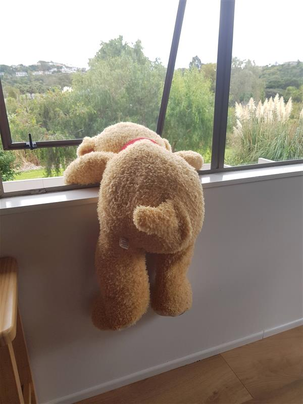

# CA.Images


# A Bulk Image Resizer 

This is an open source project aiming to provide a little utility to enable bulk resizing of images on a local machine.
The premise is that you have a bunch of images all within the same directory that need to be resized keeping the existing aspect ratio, but making the images smaller. 

## Use cases:
1. Websites wanting to make their existing images smaller for faster download times:
2. Websites wanting to provide small preview sized of their existing images 
3. Some websites will not allow uploading of full size images, the need to be resize first.
4. Am sure there are many other reasons.


#Quick Example 
The following code will resize all images in the current directory to a max width of 1024 pixels. 
``` 
C:\MyImageFOlder>CA.Images resize -w 1024
```

The original images are not modified, the resize images will places in a nested directory called "ResizedImages" By default the name of the file will be 

{original file name}{width}x{height}.{original file type}

#Example Resixe Image
Below is a example of a images resized, the Original image is  4.69MB the resized image is 0.053MB. This is about 1% of the Original size with 
<table width="100%"><tr><th>Original</th><th>Resized</th></tr>
<tr>
    <td>
    <figure>
        
        <figcaption>Original Image is 4,928,291 bytes or 4.69MB</figcaption>
    </figure>
    </td>
    <td>
        <figure>
        
        <figcaption>Resized Image is 53,938 bytes bytes or 0.05MB size to max width of 1024px</figcaption>
    </figure>
    <td>
</tr>
<table>


